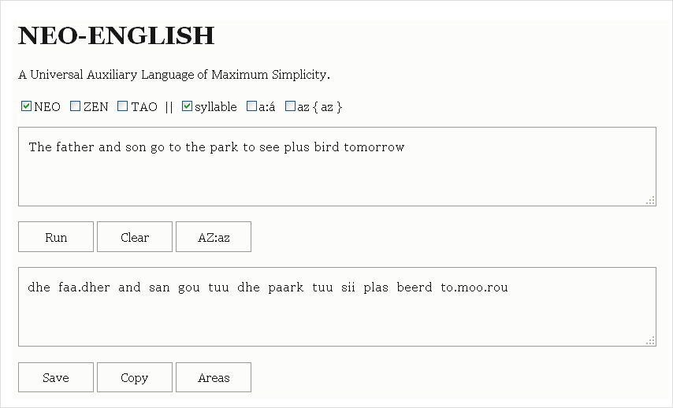
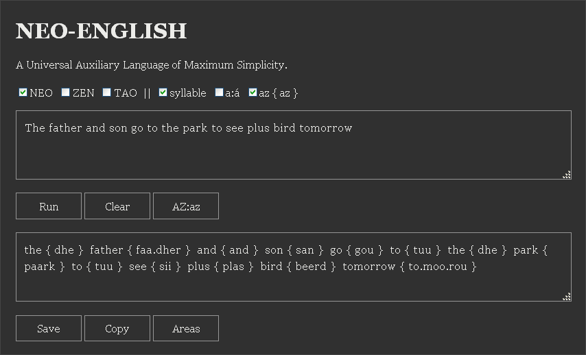

# Neo-English (NE)

> A Universal Auxiliary Language of Maximum Simplicity, constructed by taking the best features of Esperanto, Spanish, Chinese, and English.

---

## Purpose and Fundamentals

The **Neo-English (NE)** is a constructed/planned language (**Conlang**) whose objective is to achieve the **maximum universal simplicity** possible in its phonology, orthography, and grammar.

This project follows a **design strategy based on radical simplification**, where:

* **Esperanto** contributes its **universal objective and goal** (as a universal auxiliary language).
* **Spanish** contributes its **phonological simplicity** (the system of **5 pure vowels: a, e, i, o, u**) and **Syllabic Rhythm** (paused) to NE.
* **Chinese** contributes its **Analytical Morphology**, **completely eliminating** **verb conjugation**, **plurals**, and **grammatical gender**.
* **English** contributes the most globally used **vocabulary** and the **base grammatical structure**, serving as **the primary source of the lexicon** after its **rigorous phonological normalization** to the NE system.

---

## Screenshots ([Demo](https://armotus.github.io/neo-english))





---

## I. The Neo-English Alphabet (NEPA)

The **NEPA** is the Neo-English Orthography and Pronunciation System. It has been designed (unlike English) to establish a **direct phonological correspondence** between **writing (orthography)** and **sound (pronunciation)**.

### 1. Vowel System: 5 Pure Vowels

NE adopts part of the Spanish vowel system, guaranteeing a pronunciation that is **clear and always pure** (with no weak or reduced sounds, **as is the case with the Schwa in English**).

| NEPA Character | IPA (&nbsp;<a href="https://en.wikipedia.org/wiki/International_Phonetic_Alphabet">Link</a>&nbsp;) | Description |
| :--- | :--- | :--- |
| **a, e, i, o, u** | a, e, i, o, u | 5 Short Vowels. |
| **aa, ee, ii, oo, uu** | a&#720;, e&#720;, i&#720;, o&#720;, u&#720; | 5 Long Vowels. |
| **ai, ei, oi, au, ou** | ai, ei, oi, au, ou | 5 Diphthongs. |
| **á , áa , ái** | **' , ' , '** | Stress Mark. |

**Reading Note:** To facilitate **reading**, unstressed long vowels can also be written with the macron diacritic: **aa**=**&#257;**, **ee**=**&#275;**, etc., and stressed long vowels can also be written with the caron diacritic: **áa**=**&#226;**, **ée**=**&#234;**, etc.

### 2. Consonants: Maximum Lexical Fidelity

The **24 consonants** of NE are **always pronounced** (including **R**, which is a simple consonant), eliminating all silent pronunciation rules of English.

| NEPA Character | IPA Phoneme | Description |
| :--- | :--- | :--- |
| **b, d, f, g, h, j, k, l, m, n, p, r, s, t, v, w, y, z** | b, d, f, g, h, &#100;&#865;&#658;, k, l, m, n, p, r, s, t, v, w, j, z | Simple Consonants. |
| **ch** | &#116;&#865;&#643; | Like 'CH' in **'church'** (digraph). |
| **dh** | &#240; | The voiced 'TH' (as in **'that'**). |
| **ng** | &#331; | The 'NG' sound (as in **'sing'**). |
| **sh** | &#643; | Like 'SH' in **'ship'** (digraph). |
| **th** | &#952; | The voiceless 'TH' (as in **'think'**). |
| **zh** | &#658; | The voiced 'S' (as in **'measure'**). |

**Reading Note:** To facilitate **readability**, the consonants **ng** and **zh** can also be written with the characters **&#331;** and **&#351;**, respectively. The free keys **Q** and **X** could also serve as **Input shortcuts** for **&#331;** and **&#351;**.

---

## II. Phonotactics and Prosody Rules

The phonotactics of Neo-English (NE) are designed to maximize **structural fidelity** to English (for lexical recognition) while enforcing a clear **syllabic rhythm**.

### 1. Syllable Structure and Clusters (Max CCCVCCCC)

NE adopts the **maximum** syllable structure of English (GA/RP) to maintain the integrity of the original words, **but its syllabification is strictly regular.**

| Component | Definitive NE Rule | Justification |
| :--- | :--- | :--- |
| **Maximum Structure** | **CCCVCCCC** (Maximum 3 Onset, Maximum 4 Coda). | **Lexical Fidelity:** Allows transcription of complex words like *glimpsed* or *scrambled*. |
| **Onset Rule** | Onset clusters (**CC** and **CCC**) are **restricted to the 60 valid sequences** of English (e.g.: 'str', 'skr', etc. [See Lists II.3]). | **Pronounceability:** Ensures that clusters are natural for an English speaker. |
| **Syllabification** | **Neo-English Syllabification (NES)**. Unique and mandatory. | **Grammatical Simplicity:** Eliminates ambiguity (ambisyllabicity), making syllable division unique and deterministic. |

### 2. Neo-English Syllabification (NES)

| Phonological Condition (Sequence) | NEO Syllabification Rule | Underlying Rationale | Conceptual Example |
| :--- | :--- | :--- | :--- |
| **1. VCV, VCCV, VCCCV and VCCCCV** | Always apply the **Maximum Onset Principle (MOP)**, using the 83 valid onsets (see Lists II.3). | **Universal Simplicity.** The MOP is the primary, quintessential syllabification rule of English. Its universal application ensures that a **syllabification and pronunciation similar to English** is obtained. | **pa.per**, **mi.stake**, **mon.ster**, **ab.stract** |
| **2. VCCV and VCCCV Exceptions** | Always apply the **Weak Syllable Principle (WSP)** if **THREE** conditions are met: **a)** C1 is **S**; **b)** V1 has **Greater Stress** than V2; and **c)** V1 is a **Short Vowel**. | **Fidelity to Phonological Emphasis.** The WSP breaks the MOP **only** in these subtle cases to guarantee a **syllabification and pronunciation more similar to English**. | **plas.tic**, **as.tro** |
| **3. Universal Exception (R Rhotic in Rhotic Vowels)** | Once the Rhotic Vowel (Vr) converts to simple **V R**, the syllabification is adjusted phonologically: R is **Onset** if a V follows (**V.RV**); R is **Coda** if a C follows (**VR.C**). | **Rhotic Fidelity.** Ensures the **naturalness of American English** by handling the R according to its intervocalic or pre-consonantal context. | **aste.roid**, **paper.back** |

**IMPORTANT:** NES syllabification is performed after The Normalization Algorithm (5 Steps) (Section IV.1) and the secondary stress is eliminated immediately after syllabification is complete.

### 3. Valid Onsets (IPA Phoneme):

The lists of permitted onsets in the **Maximally Onset Principle (MOP)** are the following:

C1 = { b, &#116;&#865;&#643;, d, &#240;, f, g, h, &#100;&#865;&#658;, k, l, m, n, p, r, s, &#643;, t, &#952;, v, w, j, z, &#658; }

C2 = { bl, fl, gl, kl, pl, sl, &#643;l, &#952;l, br, dr, fr, gr, kr, pr, &#643;r, tr, &#952;r, dw, gw, hw, kw, pw, sw, tw, &#952;w, vw, bj, dj, fj, gj, hj, kj, lj, mj, nj, pj, sj, tj, &#952;j, vj, zj, sf, sk, sm, sn, sp, st, s&#952; }

C3 = { skl, spl, sfr, skr, spr, str, skw, skj, smj, snj, spj, stj }

Lists II.3 (Bibliography: Wikipedia, MOP).

### 4. Rhythm and Accentuation

NE prioritizes **syllabic rhythm** (like Spanish) and applies **orthographic flexibility** to maximize adoption. Total rigor is an option, not an obligation in everyday writing:

| Element | Writing Rule (Usage) | Justification for Flexibility |
| :--- | :--- | :--- |
| **Language Rhythm** | **Syllabic Rhythm (Spanish/Chinese).** All syllables receive similar duration. | **Universal Usability** |
| **Tonic Accent (Acute Accent)** | **Optional/Omitted:** Can be omitted. It is assumed the user deduces the accent through familiarity with English or context. | **Maximum Adoption:** Avoids visual overload for users accustomed to English. |
| **Syllable Separator (Period .)** | **Optional/Omitted:** Can be omitted. The most common pronunciation is assumed, leaving disambiguation to context. | **Minimum Friction:** Only recommended in cases of extreme ambiguity (e.g., n.g vs ng). |

---

## III. Lexicon and Morphology (Analytical Morphology)

Neo-English (NE) grammar is based on the **SVO Syntax** of English, but applies **Radical Analytical Morphology** (inspired by Mandarin), resulting in a **Zero Inflection** system compensated by **Strict Syntax**.

### 1. Zero Inflection (Analytical Morphology)

The fundamental principle of NE is **invariability**. Words do not inflect, which eliminates the need to memorize conjugation tables, plurals, or gender.

* **Verbs (Zero Conjugation):** Verbs are **invariable**; they do not change for tense, person, or number. Tense, aspect, and **mood** are indicated **EXCLUSIVELY** by **adverbs and adverbial phrases** (e.g.: *today, tomorrow, maybe, last year*). If the context does not specify the tense, the **present** or habitual action is assumed.
* **Nouns (No Flexional Plurals):** Nouns are **invariable** (they have no gender, number, or case). Plurality is marked, **only when necessary** for clarity, by a **quantifier** preceding the noun.
    * **Explicit Plurality:** Lexical quantifiers from English are used (e.g.: *thrii, menii, ets.* [three, many, etc.]).
    * **General Indefinite Plurality:** A double-form generic quantifier is used: **plas** [normalized 'plus'] (before vowels and other consonants) or **moor** [normalized 'more'] (before words starting with S, Z, SH, or ZH). This quantifier must be placed **always at the beginning of the noun phrase**, preceding the noun or any adjective that modifies it.
* **Non-Nouns (No Flexional Plurals):** **Other word types besides nouns** with number inflection must be used in their singular form, eliminating all number morphological inflection. (e.g.: *dhat plas buk* [those books]; *its plas doog* [their dogs]). **Note:** Personal pronouns (such as I, She, Your, Her, They, etc.) and possessive determiners (such as My, Your, Our, etc.) that do not inflect for number in English do not fall into this category and must be used as in original English.
* **Lexical Ambiguity:** The same lexical root (e.g.: **ran** or **kar** [run or car]) can function as various grammatical classes (noun / verb / adjective). This ambiguity is resolved **exclusively by the strict position in the Syntax**.

### 2. Syntactic Structure (Strict SVO Order)

Analytical morphology mandates that word order be **strict and mandatory**, with position being the **primary grammatical marker**.

| Syntactic Rule | Mandatory Detail | Purpose |
| :--- | :--- | :--- |
| **Default Order** | **Subject-Verb-Object (SVO)**. This order is **strict and mandatory** in transitive sentences. | Defines grammatical functions (Subject, Verb, Object). |
| **Adjective Position** | The modifying adjective must **always precede** the noun it modifies (e.g.: *big haus* [big house]). | Eliminates Adjective / Noun ambiguity. |
| **Adverb Position** | The adverb must **precede the element** it modifies (e.g.: *kwiklii ran* [quickly run]) or be placed **at the beginning** / **end of the sentence** to modify the main verb. | Ensures clarity of the modifier's scope. |
| **Negation Rule** | Negation is marked **EXCLUSIVELY** by the particle **nou** [normalized 'no'] placed **before the verb** (e.g.: *Ai nou ran* [I not run/I do not run, etc.]). | Maintains Zero Inflection and Strict Syntax. |
| **Interrogation Rule** | Yes/No questions **MUST** start with the auxiliary particle **duu** [normalized 'do'], followed by SVO order (e.g.: *Duu yuu sii plas doog?* [Do you see dogs?]). | Distinguishes questions from declarative sentences using strict position. |

---

## IV. Lexicon and Normalization Principles (Matrix Rule)

The Neo-English (NE) lexicon is built under **Maximum Lexical Similarity with American English (GA)**, prioritizing **clarity of the root** and **phonological regularity**. The normalization of any English word is governed **primarily** by the following 5-step algorithm.

### 1. The Normalization Algorithm (5 Steps)

The process uses the phonological transcription of **American English (GA)** (using systems like IPA / ARPABET / CMU) as a base and applies correction rules to achieve the phonological clarity of NE and recover key British (RP) distinctions.

| Step | Conversion Rule | NE Result | Design Justification |
| :--- | :--- | :--- | :--- |
| **1. Consonants** | The phonological transcription of the 24 consonants of GA is mapped directly to the 24 consonants of NE (Section I). | NE Consonants. | Ensures maximum familiarity in consonants and **Zero Inflection**. |
| **2. Simple Vowels / Diphthongs** | The phonemes of short vowels /&#652;, &#603;, &#618;, &#594;, &#650;, &#230;/, long vowels /&#105;&#720;, &#596;&#720;, &#117;&#720;/ and diphthongs /a&#618;, e&#618;, o&#618;, a&#650;, o&#650;/ of GA are mapped directly to the short vowels (a, e, i, o, u, a), long vowels (ii, oo, uu) and diphthongs (ai, ei, oi, au, ou) of NE. | NE Vowels / Diphthongs. | Establishes the **vowel simplicity** of Spanish. |
| **3. Rhotics** (**R-Coloured**) | The rhotic phonemes /&#602;, &#605;&#720;/ of GA are mapped to **&#601;** (Schwa) and long vowel **ee** followed by the **simple r** of NE. | **&#601;r, eer** | Confirms the **rhotic** nature of NE and simplifies pronunciation (**without R-Coloured**). |
| **4. Long Vowel Correction /&#593;&#720;/** | The long vowel phoneme /&#593;&#720;/ of GA is mapped to the vowel **o** of NE if, and only if, the **orthographic** vowel in the original word is an **o** (e.g.: h**o**t to **hot**). Otherwise, it is mapped to the long vowel **aa** of NE (Table IV.2). | **o, aa** | **RP Exception Rule:** Recovers the short vowel distinction **o** /&#594;/ of British English using the spelling. |
| **5. Schwa Correction /&#601;/** | The Schwa phoneme /&#601;/ is disambiguated and mapped to one of the 5 vowels of NE (a, e, i, o, u) using the **orthographic assimilation table** (Table IV.2). | **a, e, i, o, u** | Eliminates the ambiguity of the Schwa, maintaining **visual familiarity** with the original word and its best pronunciation by replacing it with one of the Spanish vowels. |

**IMPORTANT:** The Normalization algorithm (5 Steps) culminates with the execution of the Neo-English Syllabification (NES) process (Section II.2), where the word receives its final syllable division and the secondary stresses are eliminated immediately after.

### 2. Transformation of Phonemes (/&#601;, &#593;&#720;/)

| Orthographic Vowel | /&#601;/ Phoneme | /&#593;&#720;/ Phoneme |
| :--- | :--- | :--- |
| a | a | aa |
| e | e | aa |
| i | a | aa |
| o | o | o |
| u | a | aa |
| ea | i | aa |
| others:au, ei | vowel | aa |
| No data | a | aa |

Table IV.2 (Bibliography: Saudino, Thesis).

---

## V. Practical Normalization Examples

This section validates the Matrix Rule Algorithm (Section IV) by showing the final Neo-English (NE) form for common vocabulary and grammatical structures.

### 1. Lexical Normalization (Base Word)

The following examples illustrate the application of the 5-step algorithm (including the /&#593;&#720;/ and /&#601;/ Schwa corrections) to generate the final lexical root of NE.

| English Word | Key Phoneme (IPA/CMU) | NE Result | Applied Rule (Step) |
| :--- | :--- | :--- | :--- |
| **green** | /&#105;&#720;/ (Long Vowel) | **griin** | Consonants (1), Long Vowels (2). |
| **stop** | /&#593;&#720;/ (RP Correction) | **stop** | /&#593;&#720;/ Correction (4). |
| **never** | /&#601;/ (Schwa) | **né.ver** | /&#601;/ Correction (5), NES (Section II). |
| **think** | /&#952;/ (Voiceless TH) | **thingk** | Consonants (1): /&#952;/ : **th**. |
| **that** | /&#240;/ (Voiced TH) | **dhat** | Consonants (1): /&#240;/ : **dh**. |
| **house** | /a&#650;/ (Diphthong) | **haus** | Base Diphthongs (2). |
| **bird** | /&#605;&#720;/ (Rhotic) | **beerd** | Rhotics (3)). |
| **water** | /&#601;/ (Final Schwa) | **wóo.ter** | /&#601;/ Correction (5). |
| **walk** | /&#596;&#720;/ (Long Vowel) | **wook** | Long Vowels (2). |
| **letter** | /&#602;/ (Rhotic) | **lé.ter** | Rhotics (3), NES (Section II). |
| **measure** | /&#658;/ (ZH Phoneme) | **mé.zhar** | Consonants (1), /&#601;/ Correction (5). |
| **judge** | /&#100;&#865;&#658;/ (J Phoneme) | **jaj** | Consonants (1). |

### 2. Simple Grammatical Structures

The sentences demonstrate Zero Inflection (Section III) and Strict Syntax (SVO).

* **Invariable Nouns (Plurality):**
    > **"Ai sii plas doog."** (I see **dogs** [indefinite plural]).
* **Invariable Verbs (Tenses):**
    > **"Ai ran kwiklii nau."** (I run quickly **now**).
    > **"Ai ran kwiklii yesterdei"** (I ran quickly **yesterday**).
* **Invariable Verbs (To Be):**
    > **"Plas beerd bii bluu."** (The birds **are** blue).
* **Derivation (Adverb/Adjective):**
    > **"Ai sii a sad man. Hii akt sadlii."** (I see a sad man. He acts **sadly**).

---

## VI. The Official Dictionary and Usage Conventions

To ensure maximum regularity and consistency in use, Neo-English establishes the "Master Reference Dictionary" as the single, mandatory source for the definitive form of every normalized word.

### 1. Master Dictionary Conventions

The dictionary must provide all necessary information to use any word without ambiguity.

| Component | Mandatory Registration Rule | Rigor Justification |
| :--- | :--- | :--- |
| **NEPA Root** | The normalized form of the root must be registered in simple NEPA notation (e.g.: *faadher*). | **Lexical Fidelity:** The final normalized form after the Matrix Algorithm (Section IV). |
| **Syllable Division** | Syllable division must always be marked with a dot (** . **) (e.g.: *fáa.dher*, *né.ver*). | **Determinism:** The Neo-English Syllabification (Section II) must be visible to eliminate ambiguities. |
| **Primary Stress** | The main stress must always be marked, **except for monosyllables** (e.g.: *fáa.dher*, *né.ver*). | **Reference Rigor:** Fixes the position of the stress **only on polysyllabic roots** to eliminate ambiguity. |
| **Grammatical Class** | The primary grammatical class of the root (Noun, Verb, Adjective) must be registered. | **Ambiguity Resolution:** Aids syntactic disambiguation (Section III). |

**Note:** The following examples are presented in their **rigorous Master Dictionary form** (with mandatory accent and syllabic separation) to illustrate the Normalization Algorithm. In usage writing, the accent and period are optional (See Section II.4).

---

## VII. Lexical Dependence and Submission (Maximum Fidelity)

Neo-English (NE) operates under the principle that **its lexicon is totally dependent and derived from English**. By design, NE **never creates** new words (*ex nihilo*) that do not have an explicit origin in the English lexicon.

The mechanisms of composition and derivation only exist as rules to **normalize** complex forms already existing in English.

* **Single-Source Principle:** The formation of derived words (prefixes, suffixes, compounding) **must always occur first and be based on the original English** (e.g.: *un- + happy = unhappy*).
* **Strict Mandatory Normalization:** The resulting compound or derived word in English (**unhappy, simplicity, runner**) must be **obligatorily** subjected to the **NEPA Normalization Algorithm (Section IV)** to obtain the final Neo-English form.
* **Functional Coherence:** The most productive affixes of English (*un-, -nes, -li, -er, -tii*, etc.) maintain a **unique and consistent grammatical function** in NE (e.g.: *-li* always creates adverbs).

### 1. Word Composition (Compounds)

NE normalizes the juxtaposition of roots that exist in English, imposing rules of clarity in the representation.

* **Transparency Clause:** Compounds must be formed exclusively by the normalization of the juxtaposition of two or more **independent lexical roots already existing in English** (e.g.: **haus-gaarden** [house-garden]).
* **Visual Marker:** The joining of roots in a compound can be indicated by a **hyphen** (e.g.: **haus-gaarden**), or joined directly (e.g.: **hausgaarden**), with the hyphen being the preferred method for clarity.

---

## VIII. Phonological Variation and Adaptations (System Robustness)

This section defines the **trends of natural phonological variation** that may arise when adopting NE, demonstrating the robustness of the written system. The core principle is that **variation in user PRONUNCIATION does not alter the written form of the base word.**

Neo-English (NE) **attempts to act as a unifying and stable base language**. It is fully tolerant of user groups creating their own **simplified variations of pronunciation and spelling**, understanding that the NE root spelling merely establishes the common, mandatory standard.

### 1. Consonantal Simplification and Neutralization

NE is robust against the neutralization of consonantal phonemes through articulatory simplification.

| NE Phoneme | Phonological Phenomenon | Neutralization Result | Implication for Writing |
| :--- | :--- | :--- | :--- |
| **D** /d/ | Assimilation to DH. | **DH** /&#240;/ | Orthography **D** is maintained. |
| **DH** /&#240;/ | Assimilation to D. | **D** /d/ | Orthography **DH** is maintained. |
| **H** /h/ | Assimilation to J. | **J** /x/ | Orthography **H** is maintained. |
| **J** /&#100;&#865;&#658;/ | Assimilation to J. | **J** /x/ | Orthography **J** is maintained. |
| **NG** /&#331;/ | Assimilation to N. | **N** /n/ | Orthography **NG** is maintained. |
| **R** /r/ | Assimilation to L. | **L** /l/ | Orthography **R** is maintained. |
| **TH** /&#952;/ | Assimilation to S. | **S** /s/ | Orthography **TH** is maintained. |
| **V** /v/ | Assimilation to B. | **B** /b/ | Orthography **V** is maintained. |
| **W** /w/ | Assimilation to U. | **U** /u/ | Orthography **W** is maintained. |
| **Y** /j/ | Assimilation to I. | **I** /i/ | Orthography **Y** is maintained. |
| **Z** /z/ | Assimilation to TH. | **TH** /&#952;/ | Orthography **Z** is maintained. |
| **Z** /z/ | Assimilation to S. | **S** /s/ | Orthography **Z** is maintained. |
| **ZH** /&#658;/ | Assimilation to TH. | **TH** /&#952;/ | Orthography **ZH** is maintained. |
| **ZH** /&#658;/ | Assimilation to SH. | **SH** /&#643;/ | Orthography **ZH** is maintained. |
| **ZH** /&#658;/ | Assimilation to S. | **S** /s/ | Orthography **ZH** is maintained. |

### 2. Vocalic, Semivocalic, and Rhotic Variation

These phenomena demonstrate NE's tolerance for variations in vowel length, glide, and rhotic structure.

| Phenomenon | Phonological Phenomenon | Implication for Writing |
| :--- | :--- | :--- |
| **Short O for Long A** | Pronunciation of the short vowel **O** as long vowel **/&#593;&#720;/**. | **Does not affect writing.** The root orthography (Section IV) is maintained. |
| **ER Monophoneme** | The rhotic sequence **ER** (eR) is pronounced as a single phoneme. | **Does not affect writing.** The orthography **eR** is maintained; variation only in pronunciation. |
| **Glide-W** | Transitional sound **/w/** between vowels. | **Does not affect writing.** Vowels remain intact. |
| **Glide-Y** | Transitional sound **/j/** between vowels. | **Does not affect writing.** Vowels remain intact. |
| **R-Linking/Intrusive** | Addition of **R** in vowel linking contexts. | **Does not affect writing.** It is a **phonal syntax** phenomenon in speech; it does not alter the lexical root. |
| **Yod-Dropping** | Loss of the semivowel **Y** (/j/) after certain consonants. | **Does not affect writing.** It is an internal phonological phenomenon to the word; the orthography **Y** is maintained. |

### 3. Prosodic and Syllable Boundary Variation

| Phenomenon | Phonological Phenomenon | Implication for Writing |
| :--- | :--- | :--- |
| **Fixed Stress** | Substitution of floating stress with fixed stress (e.g.: penultimate syllable). | **Does not affect writing.** The Dictionary (Section VI) is the source of stress. |
| **Ambisyllabicity** | The consonant is shared simultaneously by the coda of the preceding syllable and the onset of the following syllable (breaking the NES). | **Does not affect writing.** NE's syllable division (NES) is **Unique and mandatory** in the dictionary. |
| **Relocation of Primary Stress** | The primary stress moves to a different syllable than the NE standard (e.g., *television* accented on the last 'o'). | **Does not affect writing.** The Dictionary (Section VI) is the source of accentuation. |
| **Addition of Secondary Stress** | A secondary stress is added to a syllable without one (e.g., **té**le**vï**sion with secondary stress on the third syllable). | **Does not affect writing.** The Dictionary (Section VI) is the source of accentuation. |

### 4. Syllabic Variation and Prothesis

| Phenomenon | Phonological Phenomenon | Implication for Writing |
| :--- | :--- | :--- |
| **Vowel Prothesis (E-Onset)** | The addition of a vowel (usually **e**) at the beginning of an Onset cluster starting with **S** (e.g.: **st, str**). This process **creates a new syllable** (e.g.: *es.tóp*) and **annuls the CC/CCC clusters** starting with S in that pronunciation. | **Does not affect writing.** The normalized root (e.g.: **stop**) is **mandatory** in the dictionary. The extra vowel is a **pronunciation variation** allowed in speech. |

### 5. Morphological Simplification

| Phenomenon | Morphological Phenomenon | Implication for Writing |
| :--- | :--- | :--- |
| **Use of Apostrophes** | Reduction in writing to indicate contraction (e.g.: *it'z* [It's]). | **Allowed in informal speech.** However, the **Dictionary (Section VI)** only registers the uncontracted form (e.g.: *it iz* [it is]). |

### 6. Simplification of Consonant Codas (User License)

To encourage fluency and reduce the memory load, the simplification of final consonant clusters (codas) is allowed, as these are a source of complexity in original English.

| Adaptation Rule | Detail | System Consequence |
| :--- | :--- | :--- |
| **Articulatory Simplification** | Users are allowed to **omit the pronunciation** of one or more consonants in complex codas (e.g.: *tekst* can be pronounced *teks*). | **Does NOT alter the spelling of the base root.** Maintains fidelity to the Master Dictionary lexicon (Section VI). |
| **Spelling Simplification (Voluntary)** | Users may **choose not to write** the unpronounced coda consonants (e.g.: writing *teks* instead of *tekst*). | **Creates valid spelling variants.** Users can generate a set of words easier to write/pronounce, maintaining reference to the Master Dictionary for their meaning. |

---

## IX. Roadmap and Implementation

The implementation of Neo-English requires the development of linguistic engineering tools to ensure consistency, adoption, and lexical expansion.

### 1. Technical Implementation Phases

The creation of NE is structured in three mandatory technical phases:

* **Phase I: Creation of the Master Dictionary.**
    * **Normalization of the Base Lexicon:** Application of the Matrix Rule Algorithm (Section IV) to the **3,000 most frequent English terms** to create the essential vocabulary (the "Core Lexicon").
    * **Rule Coding:** Creation of a *software* or *script* (e.g.: Python) that automates the 5-Step Algorithm and the /&#593;&#720;/ and /&#601;/ corrections from the **Table IV.2**.
    * **Rigorous Registration:** Each entry must register its Primary Grammatical Class, Syllable Division, and **Mandatory Stress** (**in the Master Dictionary** [Section VI]).
* **Phase II: Development of Adoption Tools.**
    * **Conversion Engine:** Development of an application that allows immediate bidirectional conversion (English &#8644; Neo-English) to facilitate initial learning.
    * **Base Didactic Material:** Creation of tutorials focused on **Strict SVO Syntax** and **Analytical Morphology**.
* **Phase III: Expansion and Standardization.**
    * **Lexical Expansion by Normalization:** Rigorous application of the Normalization rules (Section IV) to **more English words** to expand the lexicon beyond the 3,000-word base.
    * **Standardization:** Creation of a reference body to monitor the consistency of NE.

### 2. Global Adoption Philosophy (Design Superiority)

NE is positioned as a superior **Universal Auxiliary Language** thanks to its hybrid design, which overcomes the barriers of traditional planned languages.

* **Lexical Familiarity:** The English vocabulary base (the most globalized language) significantly reduces the initial learning curve.
* **Phonological Simplicity:** The adoption of the 5 pure vowel system (Spanish) eliminates pronunciation barriers for most speakers worldwide.
* **Grammatical Simplicity:** **Zero Inflection** (Chinese/Mandarin) offers maximum morphological simplicity without the need to memorize conjugation or declension tables.

---

## BIBLIOGRAPHY

&#8226; CMU : The CMU Pronouncing Dictionary (&nbsp;<a href="https://en.wikipedia.org/wiki/CMU_Pronouncing_Dictionary">Link</a>&nbsp;)

&#8226; MOP : Maximal Onset Principle (&nbsp;<a href="https://en.wikipedia.org/wiki/English_phonology">Link</a>&nbsp;)

&#8226; WSP : Weak Syllable Principle (&nbsp;<a href="https://en.wikipedia.org/wiki/Syllable">Link</a>&nbsp;)

&#8226; URL : Phonemic Orthography (&nbsp;<a href="https://en.wikipedia.org/wiki/Phonemic_orthography">Link</a>&nbsp;)

&#8226; URL : Cambridge Dictionary (&nbsp;<a href="https://dictionary.cambridge.org/dictionary/english/run">Link</a>&nbsp;)

&#8226; URL : Alphabetic Principle (&nbsp;<a href="https://en.wikipedia.org/wiki/Alphabetic_principle">Link</a>&nbsp;)

&#8226; Gemini Google's AI Assistant (&nbsp;<a href="https://en.wikipedia.org/wiki/Gemini_(chatbot)">Link</a>&nbsp;)

&#8226; Universal Auxiliary Language (&nbsp;<a href="https://en.wikipedia.org/wiki/International_auxiliary_language">Link</a>&nbsp;)

&#8226; Ezequiel Pablo Saudino, Thesis (&nbsp;<a href="https://bibliotecadigital.exactas.uba.ar/collection/seminario/document/seminario_nCOM000721_Saudino">Link</a>&nbsp;)

## INSTALLATION

```bash
npm i neo-english
```

## USAGE

```js
let text = 'The father and son go to the park to see plus bird tomorrow';
let transcriber = require('neo-english');
let NEPAphonemetext = transcriber.Transcribe(text,1,1,0,0,0);
let ZEPAphonemetext = transcriber.Transcribe(text,2,1,0,0,0);
let TEPAphonemetext = transcriber.Transcribe(text,3,1,0,0,1);

console.log(NEPAphonemetext);
console.log(ZEPAphonemetext);
console.log(TEPAphonemetext);

// dhe  faa.dher  and  san  gou  tuu  dhe  paark  tuu  sii  plas  beerd  to.moo.rou
// dhe  fā.dher  and  san  gou  tū  dhe  pārk  tū  sī  plas  bērd  to.mō.rou
// de  fā.der  and  san  gou  tū  de  pārk  tū  sī  plas  bērd  to.mō.rou
```

## TEST

```bash
npm test
```

## DEMO

[HOME](https://armotus.github.io/neo-english)

## LICENSE

[ABC](abc/abc.md)
